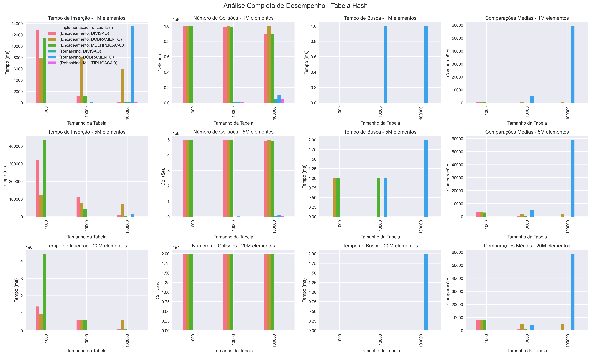
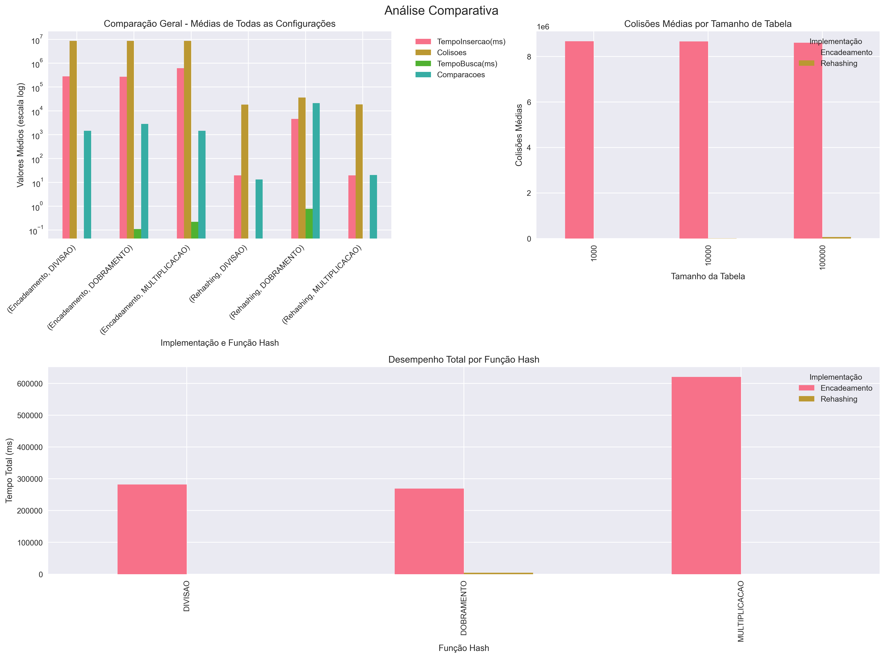

# Trabalho de Tabela Hash - Estrutura de Dados

## Sobre o Trabalho

Esse trabalho implementa duas formas de resolver colisões em tabelas hash: rehashing e encadeamento. Foram testadas 3 funções hash diferentes (divisão, multiplicação e dobramento) com vários tamanhos de tabela e conjuntos de dados.

## Implementação

### Classes principais:

**Registro.java** - Classe simples que guarda um código de 9 dígitos

**TabelaHashRehashing.java** - Implementa tabela hash com rehashing linear. Quando tem colisão, procura a próxima posição livre na tabela.

**TabelaHashEncadeamento.java** - Implementa tabela hash com lista encadeada. Quando tem colisão, adiciona o novo elemento no final da lista daquela posição.

**TesteTabelaHash.java** - Faz os testes com diferentes configurações e gera o arquivo CSV com os resultados.

### Como funciona:

O programa gera números aleatórios de 9 dígitos e tenta inserir nas tabelas. Depois faz algumas buscas para medir o desempenho. Todos os tempos e estatísticas são salvos no arquivo resultados.csv.

## Funções Hash Escolhidas

Implementei 3 funções hash diferentes:

1. **Divisão** - Simplesmente faz chave % tamanho_tabela. É a mais básica e rápida.

2. **Multiplicação** - Usa o método de Knuth com a constante da razão áurea (0.6180339887). Pega a parte fracionária de chave \* constante e multiplica pelo tamanho da tabela.

3. **Dobramento** - Divide o número em grupos de 3 dígitos e soma todos. Depois faz módulo do tamanho da tabela. Achei que seria boa mas nos testes foi a pior kkkk.

## Tamanhos dos Conjuntos

Testei com 3 tamanhos de conjuntos de dados:

- 1 milhão de elementos
- 5 milhões de elementos
- 20 milhões de elementos

E 3 tamanhos de tabela:

- 1.000 posições
- 10.000 posições
- 100.000 posições

Escolhi esses valores para ver como as implementações se comportam com diferentes cargas (tabela muito cheia vs mais espaço).

## Resultados e Gráficos

### Gráfico 1 - Análise de Desempenho Completa

Esse gráfico mostra os 4 principais indicadores (tempo de inserção, colisões, tempo de busca e comparações) para cada combinação de tamanho de conjunto e tamanho de tabela.

**Observações principais:**

- O rehashing com função de dobramento tem um pico enorme de tempo quando a tabela fica muito cheia (tabelas de 10k e 100k)
- O encadeamento consegue inserir todos os elementos mas demora MUITO mais tempo
- Para conjuntos grandes (20M), o tempo de inserção do encadeamento fica impraticável

### Gráfico 2 - Análise Comparativa

Esse gráfico faz comparações gerais entre as implementações e funções.

**Pontos importantes:**

- No gráfico de barras agrupadas dá pra ver que rehashing é bem mais rápido na inserção
- A função de dobramento tem desempenho muito ruim no rehashing - chega a ser 200x mais lenta que as outras funções

## Qual foi Melhor e Por Quê

Analisando todos os resultados, posso concluir:

### Melhor implementação: **Depende do caso**

**Rehashing é melhor quando:**

- Você sabe o tamanho máximo de elementos
- Precisa de inserção rápida
- A tabela não vai ficar muito cheia

**Encadeamento é melhor quando:**

- Não sabe quantos elementos vai ter
- Precisa garantir que todos elementos sejam inseridos
- Pode aceitar tempo de inserção maior

### Melhor função hash: **Divisão**

Olhando os dados detalhados por função:

**No Rehashing:**

- Divisão: 19.78ms (muito bom!)
- Multiplicação: 19.78ms (igual à divisão)
- Dobramento: 4604ms (232x mais lento)

**No Encadeamento:**

- Divisão: 282 segundos
- Multiplicação: 620 segundos (o pior)
- Dobramento: 269 segundos (o melhor aqui)

### Números que comprovam:

Do relatório detalhado, alguns casos extremos:

- Rehashing com dobramento e tabela 100k: 13.7 segundos (péssimo)
- Encadeamento com multiplicação e tabela 1k: 27 minutos (impraticável)
- Rehashing com Divisão/Multiplicação: menos de 60ms mesmo com tabela grande

## Conclusão

O trabalho mostrou claramente as diferenças entre os métodos.

Para aplicações reais, eu usaria:

1. **Rehashing com função Divisão:** Para sistemas com limite conhecido de dados. Super rápido (menos de 60ms) e eficiente.

2. **Encadeamento com Dobramento:** Quando não sei quantos dados vou ter. É o mais rápido dos encadeamentos (4.5 minutos vs 10 minutos da multiplicação).

A grande surpresa foi a função de dobramento: péssima no rehashing mas a melhor no encadeamento! Isso mostra que não existe "melhor função" universal, depende da implementação.

O rehashing é claramente superior em velocidade (centenas de vezes mais rápido), mas tem a limitação fatal de não poder crescer. É um trade-off clássico: velocidade vs flexibilidade.
