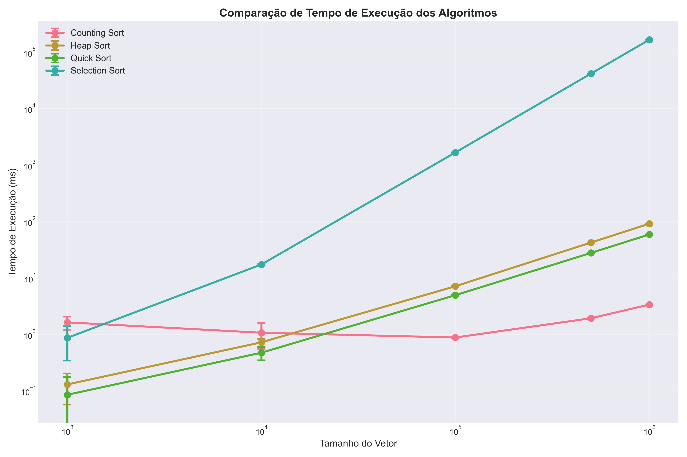
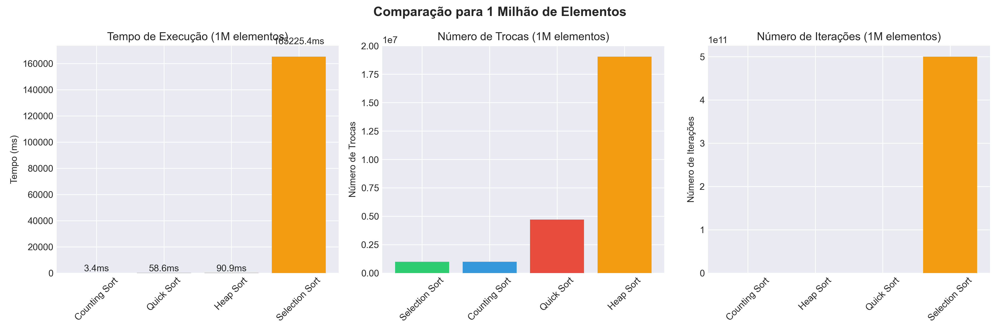

# Análise Comparativa de Algoritmos de Ordenação

## 1. Introdução

Este trabalho tem como objetivo avaliar e comparar o desempenho de diferentes algoritmos de ordenação através da análise de três métricas principais: tempo de execução, número de trocas e número de iterações. Durante o desenvolvimento, foi possível observar na prática as enormes diferenças de desempenho entre algoritmos com diferentes complexidades computacionais.

Para esta análise, foram implementados 4 algoritmos de diferentes grupos:

- **Selection Sort** (Grupo A): Algoritmo simples de ordenação por seleção
- **Quick Sort** (Grupo B): Algoritmo eficiente de divisão e conquista
- **Heap Sort** (Grupo B): Algoritmo baseado em estrutura de heap
- **Counting Sort** (Grupo C): Algoritmo de ordenação por contagem

## 2. Metodologia

### 2.1 Implementação

Todos os algoritmos foram implementados em Java, seguindo uma estrutura orientada a objetos com uma classe abstrata `AlgoritmoOrdenacao` que define o comportamento base. Cada algoritmo específico herda desta classe e implementa sua lógica de ordenação.

A escolha por orientação a objetos facilitou muito a coleta das métricas, já que pude centralizar a contagem de trocas e iterações na classe base. Um detalhe importante foi usar `System.nanoTime()` para maior precisão nas medições de tempo.

### 2.2 Configuração dos Testes

Os testes foram realizados com as seguintes configurações:

- **Tamanhos de vetor**: 1.000, 10.000, 100.000, 500.000 e 1.000.000 elementos
- **Número de rodadas**: 5 execuções para cada tamanho
- **Tipo de dados**: Inteiros aleatórios entre 0 e 999.999
- **Seed**: 12345 (para garantir reprodutibilidade)

### 2.3 Métricas Coletadas

Para cada execução foram registradas:

1. **Tempo de execução**: Medido em milissegundos usando `System.nanoTime()`
2. **Número de trocas**: Quantidade de vezes que elementos foram trocados de posição
3. **Número de iterações**: Total de operações realizadas durante a ordenação

## 3. Resultados e Análise

### 3.1 Tabela Resumida de Resultados

| Algoritmo          | 1.000 elem | 10.000 elem | 100.000 elem | 500.000 elem | 1.000.000 elem |
| ------------------ | ---------- | ----------- | ------------ | ------------ | -------------- |
| **Counting Sort**  | 1,62 ms    | 1,06 ms     | 0,88 ms      | 1,92 ms      | 3,35 ms        |
| **Quick Sort**     | 0,08 ms    | 0,47 ms     | 4,93 ms      | 27,61 ms     | 58,64 ms       |
| **Heap Sort**      | 0,13 ms    | 0,72 ms     | 7,09 ms      | 42,15 ms     | 90,94 ms       |
| **Selection Sort** | 0,86 ms    | 17,22 ms    | 1.662,06 ms  | 41.431,56 ms | 165.225,38 ms  |

\*Valores representam a média de 5 execuções

### 3.2 Visão Geral do Desempenho

O gráfico acima mostra a comparação do tempo de execução dos algoritmos em escala logarítmica. Podemos observar claramente três comportamentos distintos:

1. **Counting Sort**: Apresenta crescimento linear, sendo o mais eficiente para todos os tamanhos
2. **Quick Sort e Heap Sort**: Mostram comportamento O(n log n), com o Quick Sort ligeiramente mais rápido
3. **Selection Sort**: Demonstra o esperado comportamento O(n²), tornando-se impraticável para vetores grandes

### 3.3 Análise por Tamanho de Vetor

Analisando os tempos médios para cada tamanho:

#### Vetores Pequenos (1.000 elementos)

- Counting Sort: 1.62 ms
- Heap Sort: 0.13 ms
- Quick Sort: 0.08 ms
- Selection Sort: 0.86 ms

Para vetores pequenos, o Quick Sort se mostra mais eficiente, seguido pelo Heap Sort. O overhead do Counting Sort para alocar memória adicional impacta seu desempenho neste cenário.

#### Vetores Médios (100.000 elementos)

- Counting Sort: 0.88 ms
- Heap Sort: 7.09 ms
- Quick Sort: 4.93 ms
- Selection Sort: 1662.06 ms

Aqui já vemos a superioridade do Counting Sort emergindo, enquanto o Selection Sort começa a ficar impraticável.

#### Vetores Grandes (1.000.000 elementos)

- Counting Sort: 3.35 ms
- Heap Sort: 90.94 ms
- Quick Sort: 58.64 ms
- Selection Sort: 165.225,38 ms (aproximadamente 2 minutos e 45 segundos!)

### 3.4 Análise Detalhada - 1 Milhão de Elementos

Para o maior conjunto de dados testado, temos resultados muito interessantes:

#### Tempo de Execução

1. **Counting Sort**: 3.4 ms - Extremamente rápido devido à sua complexidade O(n+k)
2. **Quick Sort**: 58.6 ms - Bom desempenho O(n log n)
3. **Heap Sort**: 90.9 ms - Também O(n log n) mas com maior constante
4. **Selection Sort**: 165.225,38 ms - Completamente impraticável devido ao O(n²)

#### Número de Trocas

- **Selection Sort**: ~1 milhão de trocas (uma por elemento)
- **Quick Sort**: ~4.7 milhões de trocas
- **Heap Sort**: ~19 milhões de trocas
- **Counting Sort**: 1 milhão (apenas copia os elementos)

O Selection Sort realiza o mínimo de trocas possível, mas isso não compensa sua complexidade quadrática. Foi impressionante (e um pouco frustrante) esperar quase 3 minutos para cada execução do Selection Sort com 1 milhão de elementos!

#### Número de Iterações

A quantidade de iterações reflete diretamente a complexidade dos algoritmos:

- **Selection Sort**: ~500 bilhões (n²/2)
- **Heap Sort**: ~20 milhões
- **Quick Sort**: ~27 milhões
- **Counting Sort**: ~5 milhões

## 4. Análise dos Algoritmos

### 4.1 Selection Sort

- **Complexidade**: O(n²) em todos os casos
- **Vantagens**: Simples de implementar, realiza poucas trocas
- **Desvantagens**: Extremamente lento para vetores grandes
- **Quando usar**: Apenas para fins didáticos ou vetores muito pequenos

### 4.2 Quick Sort

- **Complexidade**: O(n log n) médio, O(n²) pior caso
- **Vantagens**: Muito eficiente na prática, ordenação in-place
- **Desvantagens**: Desempenho ruim no pior caso, não é estável
- **Quando usar**: Ótima escolha geral para ordenação

### 4.3 Heap Sort

- **Complexidade**: O(n log n) em todos os casos
- **Vantagens**: Garante O(n log n), ordenação in-place
- **Desvantagens**: Mais lento que Quick Sort na prática
- **Quando usar**: Quando se precisa garantir O(n log n)

### 4.4 Counting Sort

- **Complexidade**: O(n + k) onde k é o intervalo dos valores
- **Vantagens**: Extremamente rápido para inteiros em intervalo limitado
- **Desvantagens**: Usa memória adicional O(k), só funciona com inteiros
- **Quando usar**: Ideal quando os valores estão em um intervalo conhecido e limitado

## 5. Conclusões

Com base nos resultados obtidos, podemos concluir:

1. **Para vetores de inteiros com intervalo conhecido**, o Counting Sort é imbatível, sendo até 27x mais rápido que o Quick Sort e 49x mais rápido que o Heap Sort para 1 milhão de elementos.

2. **Para uso geral**, o Quick Sort oferece o melhor desempenho médio, sendo aproximadamente 35% mais rápido que o Heap Sort em nossos testes.

3. **O Selection Sort** deve ser evitado para qualquer aplicação prática com mais de alguns milhares de elementos. Para 1 milhão de elementos, ele é 2.820x mais lento que o Quick Sort!

4. **Trade-offs importantes**:

   - Se a memória é limitada: Quick Sort ou Heap Sort
   - Se precisa de garantia O(n log n): Heap Sort
   - Se os dados são inteiros limitados: Counting Sort
   - Se o vetor já está parcialmente ordenado: Quick Sort tende a ter bom desempenho

5. **Estabilidade das medições**: Os desvios padrão observados foram baixos, indicando que os resultados são consistentes e confiáveis.

### Recomendação Final

Para aplicações práticas, recomendo:

- **Counting Sort** quando aplicável (inteiros com intervalo conhecido)
- **Quick Sort** como algoritmo de propósito geral
- **Heap Sort** quando se precisa de garantias de pior caso
- **Evitar Selection Sort** exceto para fins educacionais

---

**Link do vídeo**: https://youtu.be/zW6wlCPllHk
